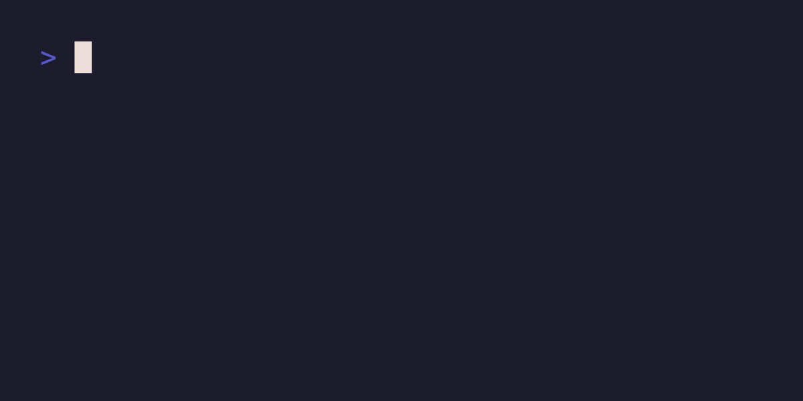

# Dotz

A colorscript that gradually fills your screen with (a) charachter.



## Installation

### Compile from source

To download the source code, build the dotz binary, and install it in `$HOME/.cargo/bin` run:

```sh
cargo install --locked --git https://github.com/KP64/dotz
```

### Nix

#### Run without installing it

```sh
nix run github:KP64/dotz -- [OPTIONS]
```

#### Flakes

```nix
# flake.nix
{
  inputs.dotz.url = "github:KP64/dotz";
}

# your configuration
{ inputs, pkgs, ... }:
{
  environment.systemPackages = [ inputs.dotz.packages.${pkgs.system}.default ];
}
```

## Usage

```txt
Usage: dotz [OPTIONS]

Options:
  -c, --char <CHAR>
          The character to print

          [default: .]

  -m, --mode <MODE>
          The printing Mode

          [default: infinite]

          Possible values:
          - fill-screen: Fill the screen immediately
          - infinite:    Continuously print characters
          - random:      Randomly color individual cells over time

  -h, --help
          Print help (see a summary with '-h')

  -V, --version
          Print version
```

## (Un)License

dotz is released into the public domain.
See the [UNLICENSE](./UNLICENSE) for more details.
